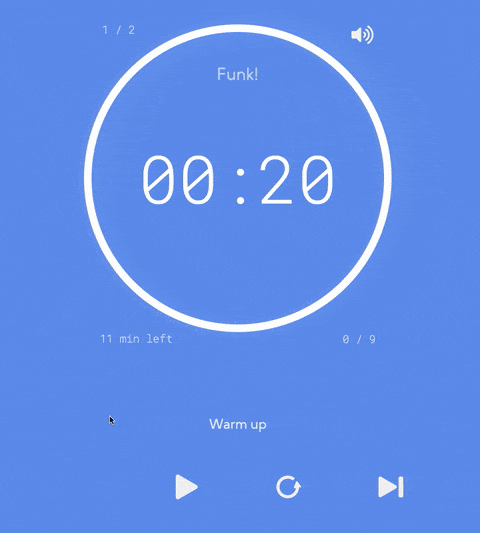
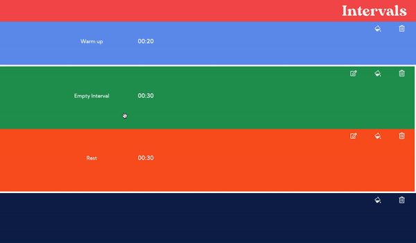
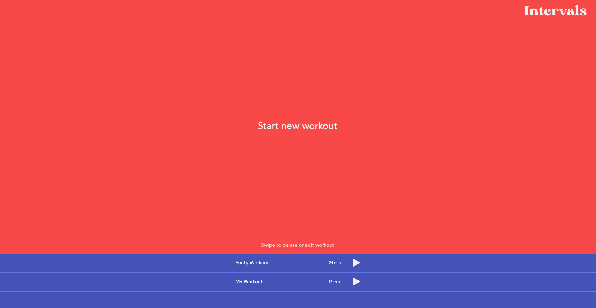
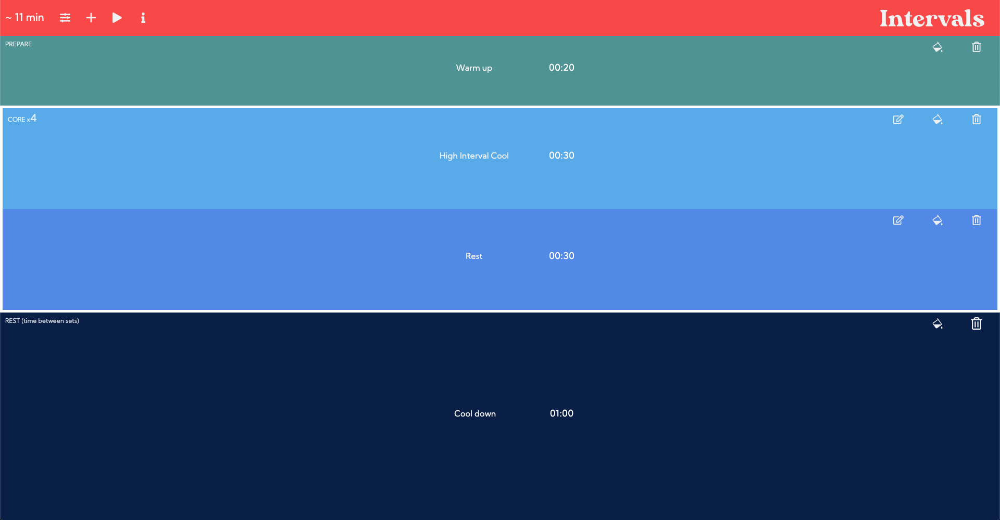
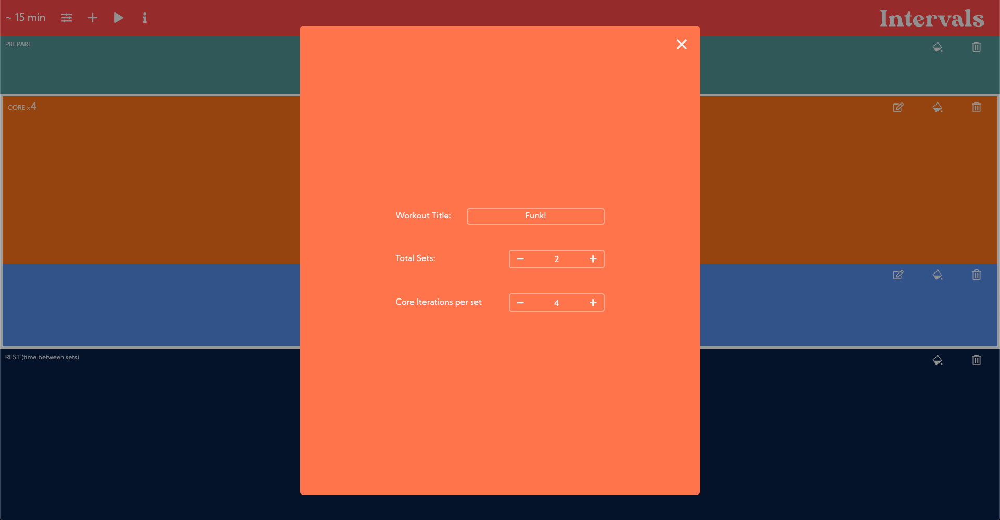
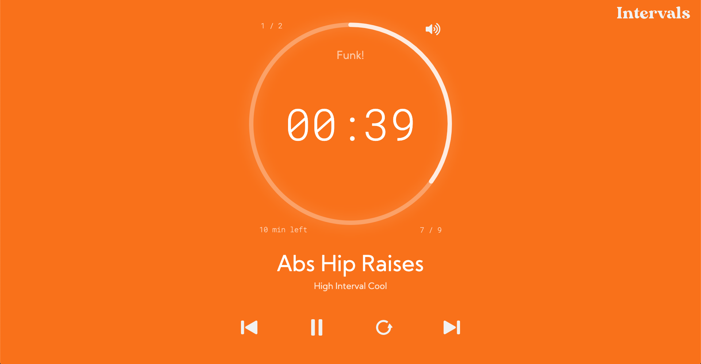

# 

 

Configurable **countdown interval timer** web app.

It allows to **create** and **run** interval trainings.

## Live

https://silly-wright-559bad.netlify.app/

## Features

-   **Listed previous workouts**, which are stored in browser's **local storage**.

-   Workout editor with block elements representing intervals, which can be easily configured with **swipe gestures** and **drag & drop** actions. User can **set iterations** for each set or interval group, give **custom names** for interval and each exercise in the set.

-   Player with beautiful **circular timer**, **controls**, UI elements showing **current workout status** ( time left, step, set...), **sound alerts** when interval starts and before it ends.

- **Minimalistic** and **intuitive** UI.

## Screenshots

 
Player in action  

 
Editor's interval blocks in action  

 
Welcome page  

 
Editor  

 
Editor  

 
Player  

## Tech Stack

-   TypeScript
-   React
-   Redux (Redux Toolkit)

## Available Scripts

In the project directory, you can run:

### `npm start`

Runs the app in the development mode. 

Open [http://localhost:3000](http://localhost:3000) to view it in the browser.

The page will reload if you make edits. 

You will also see any lint errors in the console.

### `npm run build`

Builds the app for production to the `build` folder. 

It correctly bundles React in production mode and optimizes the build for the best performance.

The build is minified and the filenames include the hashes. 

## Links

-   Live: https://silly-wright-559bad.netlify.app/

-   Repository: https://github.com/EmilTheSadCat/intervals

## Licensing

The code in this project is licensed under ISC license.
